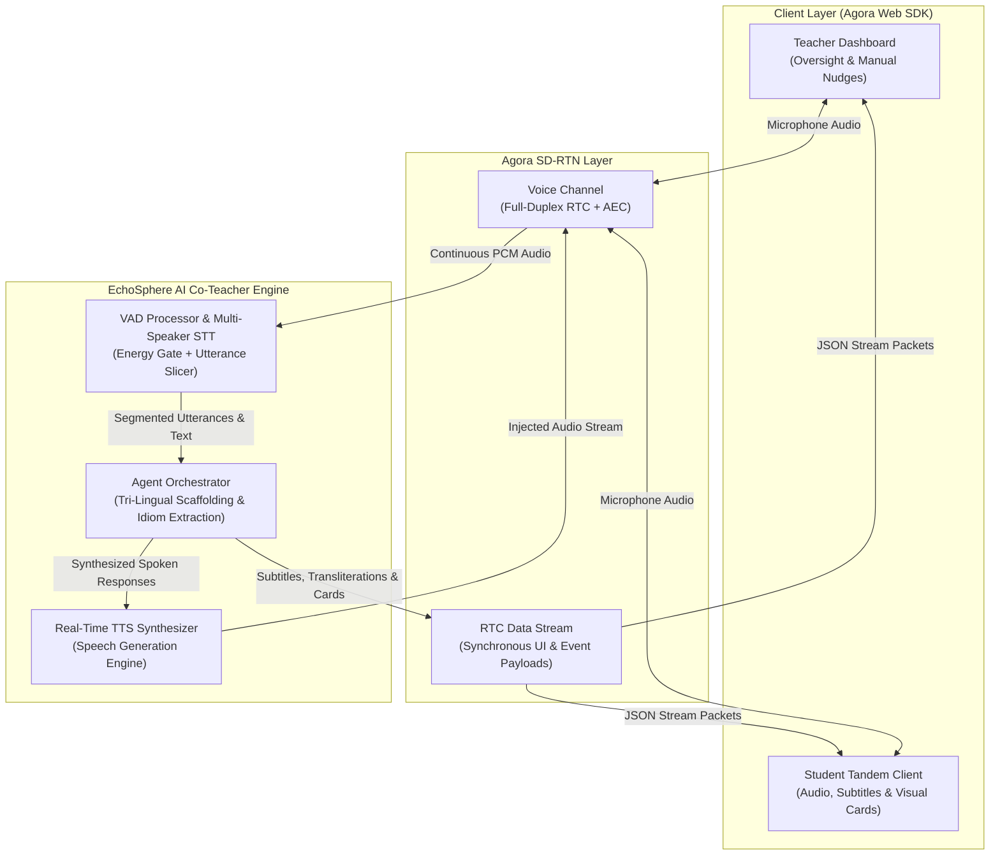

# EchoSphere Tandem Co-Teacher

### Ambient Real-Time AI-Augmented Peer Language Learning Platform on Agora SD-RTN

[](dev/plans/implementation_plan_tandem.md)
[](pyproject.toml)
[](src/rtc/agora_client.py)
[](dev/specs/spec_tandem.md)
[](pyproject.toml)

---

## 1. Executive Overview & Problem Alignment

EchoSphere Tandem Co-Teacher is an ambient, real-time AI-augmented peer language learning platform. Powered by the Agora SD-RTN (Software-Defined Real-Time Network) and an intelligent multi-agent orchestration layer, EchoSphere mediates live peer-to-peer conversations across **Hindi (`hi`)**, **Japanese (`ja`)**, and **English (`en`)**.

In traditional language classrooms, learners experience high conversational anxiety while human instructors face cognitive overload attempting to concurrently observe and scaffold multiple breakout rooms. EchoSphere solves this by embedding an ambient AI co-teacher directly into the real-time audio and data channels.

| Core Problem | Traditional Friction | EchoSphere Technical Solution |
| --- | --- | --- |
| **Learner Anxiety & Dead Air** | Awkward silences, lack of speaking confidence, and demotivation in unassisted dialogues. | Real-time Voice Activity Detection (VAD) detects conversational stalls and dynamically generates context-aware, culturally grounded prompts. |
| **Teacher Bandwidth Bottlenecks** | Instructors cannot concurrently monitor or transcribe multiple live breakout sessions. | Synchronous live transcripts, automated peer speaking-time balance meters, and teacher intervention controls broadcasted over Agora Data Streams. |
| **Complex Code-Switching** | Natural tri-lingual exchange (e.g., Hinglish, Japanglish) causes traditional STT engines to fail. | Contextual multi-speaker STT with phonetic transliteration (Devanagari / Romaji) and cross-lingual idiom annotations. |
| **Rigid Turn-Taking & High Latency** | Sequential turn-based AI bots introduce high latency, disrupting natural human flow. | Sub-400ms full-duplex Agora SD-RTN audio bus with barge-in support and parallel zero-latency UI stream synchronization. |

---

## 2. Key Capabilities & Technical Highlights

- **Full-Duplex Sub-400ms Voice Communication**: Full-duplex audio over Agora SD-RTN with hardware Acoustic Echo Cancellation (AEC) and conversational barge-in support.
- **Tri-Lingual Exchange Pipeline**: Specialized semantic mediation across Hindi, Japanese, and English:
  - **Japanese <-> English**: Honorific context (*Keigo*), Romaji assistance, and cultural idiom explanations.
  - **Hindi <-> English**: Code-switched Hinglish parsing, Devanagari transliteration, and register formality (*Aap* vs. *Tum*).
  - **Hindi <-> Japanese**: Direct cultural bridges, comparative grammar hints, and shared Subject-Object-Verb (SOV) structural alignment.
- **Real-Time Synchronous Data Streaming**: Live visual scaffolding (subtitles, idiom popup cards, interactive quizzes, and balance indicators) broadcasted synchronously over Agora RTC Data Streams.
- **Human-in-the-Loop Teacher Dashboard**: Human educators retain ultimate supervisory control with real-time room oversight, live transcript feeds, and on-demand intervention nudges.
- **Resilient Fallback Architecture**: Seamless graceful degradation from cloud AI models (Whisper / Gemini / Edge-TTS) to local heuristic pipelines during offline or high-latency network conditions.

---

## 3. System Architecture



---

## 4. Architectural Deep Dives

### 4.1 Audio Processing & Voice Activity Detection (VAD)

The audio ingestion layer ([`src/audio/vad_processor.py`](src/audio/vad_processor.py)) processes continuous 16kHz 16-bit linear PCM streams:

1. **Frame Slicing**: Splits incoming audio into discrete 20ms frames (640 bytes per frame).
2. **Dual-Stage Activity Gate**: Employs RMS energy gating combined with WebRTC VAD classification to filter ambient room noise and non-vocal audio.
3. **Pre-Speech Ring Buffer**: Maintains a 200ms rolling circular buffer to recover word-onset plosives and consonants preceding threshold detection.
4. **Hangover Segmentation**: Applies a configurable silence hangover window (200ms-600ms) to slice complete utterances before forwarding them to the STT transcriber ([`src/audio/stt_transcriber.py`](src/audio/stt_transcriber.py)).

### 4.2 Agora RTC Client & Data Stream Synchronization

The RTC communication engine ([`src/rtc/agora_client.py`](src/rtc/agora_client.py)) manages SD-RTN connectivity and binary data stream broadcasting:

- **Dynamic Token Management**: Generates role-based cryptographic channel tokens using `agora-token-builder`.
- **Packet Serialization**: Serializes UI metadata into `RTCDataStreamPacket` JSON payloads:
  - `subtitles`: Multi-lingual parallel text with Romaji and Devanagari transliteration.
  - `idiom_card`: Contextual explanations of cultural phrases, idioms, and slang.
  - `topic_prompt`: Conversation starter prompts triggered on silence detection.
  - `quiz`: In-flight comprehension checks and vocabulary reinforcement.
  - `teacher_alert`: Automated telemetry flags notifying instructors of conversational imbalance.

---

## 5. Repository Directory Structure

```text
EchoSphere/
├── app/                     # Web Client Application (Agora Web SDK)
│   ├── index.html           # Tandem classroom UI layout
│   ├── src/                 # Client components, styles, and data stream listeners
│   └── package.json         # Frontend dependencies and build scripts
│
├── src/                     # Backend AI Engine & Real-Time Orchestrator
│   ├── audio/               # Audio processing (vad_processor.py, stt_transcriber.py, tts_synthesizer.py)
│   ├── rtc/                 # Agora SD-RTN engine (agora_client.py, data_stream.py)
│   ├── agent/               # Multi-agent prompt orchestrator & language models
│   ├── server.py            # Main application lifecycle manager & API server
│   └── requirements.txt     # Python backend dependencies
│
├── tests/                   # Automated unit and integration test suite
│   ├── test_audio.py        # VAD, STT, and Agora RTC client tests
│   └── test_agent.py        # Agent prompt and orchestration tests
│
├── .env.example             # Environment configuration template
├── pyproject.toml           # Project build definition and pytest configuration
└── README.md                # Project documentation and engineering summary
```

---

## 6. Technology Stack

### Backend & AI Runtime

- **Language**: Python 3.11+ managed via **`uv`**
- **Real-Time Communication**: Agora SD-RTN Python SDK & `agora-token-builder`
- **Speech Processing**: `webrtcvad`, `scipy`, `numpy`
- **AI Orchestration**: Google GenAI SDK (`gemini-1.5-flash`), OpenAI API (`whisper-1`, `gpt-4o`)
- **Speech Synthesis**: `edge-tts`, `gTTS`
- **API & Networking**: `fastapi`, `uvicorn`, `websockets`

### Frontend Client

- **Runtime**: Node.js & npm
- **Real-Time Web RTC**: Agora Web SDK v4 (`agora-rtc-sdk-ng`)
- **Styling**: Modern macOS Light glassmorphism, responsive Vanilla CSS
- **Data Protocol**: Binary / JSON Web Data Streams

---

## 7. Getting Started

### Prerequisites

- [Python 3.11+](https://www.python.org/)
- [uv](https://docs.astral.sh/uv/) (Fast Python package and virtualenv manager)
- [Node.js 18+](https://nodejs.org/) & `npm`
- [Agora Developer Account](https://console.agora.io/) (App ID and App Certificate)

### 1. Clone & Environment Configuration

Clone the repository and copy the environment template:

```bash
git clone https://github.com/Ryosuke-Kawashima-Career/Tandem-Assistant.git EchoSphere
cd EchoSphere
cp .env.example .env
```

Configure your credentials in `.env`:

```ini
AGORA_APP_ID=your_agora_app_id
AGORA_APP_CERTIFICATE=your_agora_app_certificate
AGORA_CHANNEL_NAME=echosphere-tandem
OPENAI_API_KEY=your_openai_api_key
GEMINI_API_KEY=your_gemini_api_key
```

### 2. Backend Setup (`uv`)

Create the virtual environment and synchronize dependencies:

```powershell
# Initialize virtual environment
uv venv

# Install backend dependencies
uv pip install -r src/requirements.txt
```

### 3. Frontend Setup (`npm`)

Install client dependencies:

```powershell
cd app
npm install
cd ..
```

---

## 8. Verification & Testing

Execute the automated test suite using `uv run pytest`:

```powershell
# Run the complete test suite
uv run pytest -v

# Run dedicated audio and RTC unit tests
uv run pytest tests/test_audio.py -v

# Verify spec and plan alignment
uv run python -c "import src.audio.vad_processor, src.audio.stt_transcriber, src.rtc.agora_client; print('All core modules imported successfully')"
```

How to run the system:

```powershell
ngrok http 8000
uv run python -m src.server
```

---

## 9. License & Attribution

This project is developed for the Agora Hackathon. Distributed under the MIT License.
All real-time communication infrastructure is powered by Agora SD-RTN.
